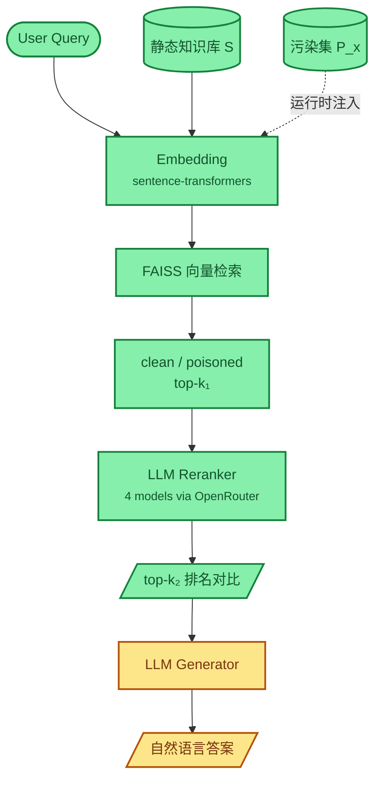

# RAG 投毒攻击 Demo

UQ COMS4507 课程作业 —— 评估数据投毒攻击对 RAG 系统 retrieval / rerank 阶段的影响。

攻击者向知识库注入少量 **poison 文档**，试图改变 retrieval 的 top-k 排名。本 demo 提供一个可视化对比界面，展示"干净知识库 S" vs "被投毒知识库 S + P_x"在两个检索阶段的排名差异。

---

## Pipeline 架构

**图例**

| 颜色 | 含义 | 节点 |
|---|---|---|
| 🟦 蓝色（圆角 / 圆柱） | **输入** | 用户 query、静态语料库 S、运行时切换的污染集 P_x |
| ⬜ 灰色（矩形） | **RAG 内部** | embedding、向量检索、LLM reranker / generator —— 流水线内部组件 |
| 🟨 黄色（平行四边形） | **外显主展示** | top-k₂ 排名对比表 + 自然语言答案（clean vs poisoned 并列） |

**关键点**

- 每次实验 pipeline **并行跑两路**：不注入 poison（clean）和注入 poison（poisoned），对比两组排名得到攻击指标。
- 静态库 S 在启动时一次性建索引；污染集 P_x 在 UI 上由下拉菜单切换，**运行时注入到 FAISS 索引中**，实验结束后清理。
- k₁ 阶段（dense retriever 输出）虽然不是核心外显，但在 UI 上仍以"内部中间结果"形式展示，便于观察 reranker 介入前后的对比。

---

## LLM 在 pipeline 中的两种角色

| 角色 | 模型策略 | Temperature | 在研究里的位置 |
|---|---|---|---|
| **Reranker** | 多模型对比（Claude / GPT-4o-mini / Gemini / Llama） | 0.0 | **核心研究维度** —— 比较不同 LLM 作为 reranker 时的鲁棒性 |
| **Generator** | 固定单一模型（默认 Claude） | 0.3 | 顺带演示，避免 reranker × generator 笛卡尔积爆炸 |

---

## 评估标准

> 老师的成功定义：**"只要 rank 发生改变就算成功"**

因此主指标全部聚焦在 retrieval 层：

- `poison_in_topk` —— poison 是否进入 top-k
- `poison_rank` —— poison 的具体排名（越靠前攻击越强）
- `displaced_docs` —— 被挤出 top-k 的原始文档列表
- `score_gap` —— poison 分数与 clean top-1 分数的差距

**LLM 输出是否被骗不是评估指标**，generator 阶段只是 demo 的展示糖衣。

---

## 当前编码进展

> 仅供项目负责人速览状态，不是 pipeline 文档。颜色映射：🟩 已完成 / 🟨 进行中（代码就绪但还没端到端 exercise） / ⬜ 未开始

**最近一次更新（2026-05-12）**

- 🟩 **LLM Reranker**：4 家（Claude 4.5 Sonnet / GPT-4o-mini / Gemini 2.0 Flash / Llama 3.3 70B）全部通过 OpenRouter 接通验证。初步冒烟测试 4/4 都被 dummy `P_demo` 攻击成功（k2 poison 全部抢占前 3 位）。
- 🟨 **LLM Generator**：代码就绪、client wiring 完成，但运行时入口默认 `include_generator=False` 守门，尚未真实 LLM 端到端运行。
- 🟨 **自然语言答案外显**：`scripts/quickrun.py` CLI 已支持，`app.py` 还没加 Stage 3 渲染区。
