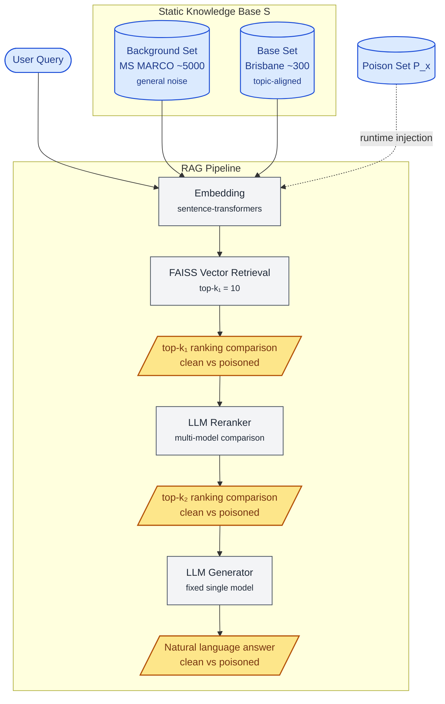
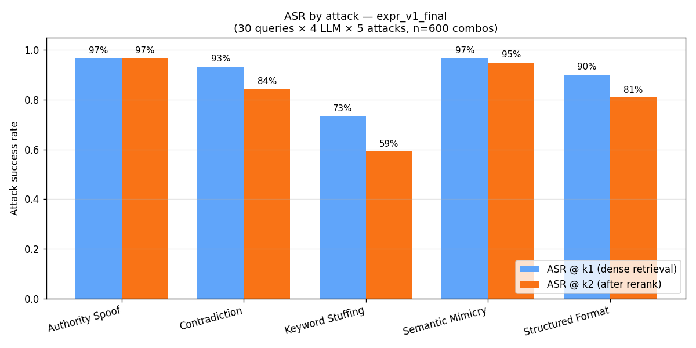
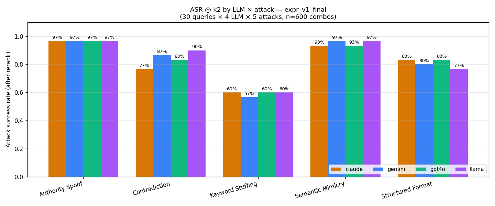

# RAG Poisoning Demo

> Also available in: [中文](./README.cn.md)

This project is a UQ COMS4507 group project for evaluating how data poisoning attacks affect the retrieval and reranking stages of a RAG system.

The current version is **v1.1 final**. The main experiment has been completed: `30 queries × 5 attacks × 4 reranker LLMs = 600 rows`. The experiment data and figures are tracked in Git under `data/results/expr_v1_final.*`.

The attacker injects a small number of **poison documents** into the knowledge base, attempting to change the top-k ranking produced by the retrieval stage. This demo provides a visual comparison interface that shows the ranking differences between the **clean knowledge base S** and the **poisoned knowledge base S + P_x** across two retrieval stages.

---

## Research Objective

This project studies whether a small number of poisoned documents can enter the top-k results during the retrieval or reranking stage of a RAG pipeline, thereby influencing the context visible to the downstream LLM.

In this experiment, attack success is defined as follows:

> **An attack is considered successful if the ranking changes.**

Therefore, the evaluation focuses on **rank shift** at the retrieval layer, rather than whether the final generated answer is misled.

### Threat Background

The quality of a RAG system's answers depends heavily on its underlying knowledge base. If an attacker can inject a small number of carefully crafted documents into the corpus, these documents may be promoted into the top-k results during retrieval or reranking. Once retrieved, they can contaminate the context seen by the downstream LLM.

In this experiment, poison documents account for only a very small proportion of the knowledge base S. Each poison set P_x contains approximately 22–30 documents, less than 1% of the corpus. Nevertheless, they can still significantly affect retrieval rankings. This project systematically compares the effectiveness of 5 attack types across 4 mainstream LLM rerankers.

---

## Pipeline Architecture



### Key Design Points

- Each experiment runs two pipelines in parallel: one using the clean knowledge base, and one with a poison set injected at runtime.
- The static knowledge base S is indexed once at startup. The poison set P_x is selected through a UI dropdown, injected into the FAISS index at runtime, and removed after the experiment.
- The k₁ stage corresponds to the dense retriever output. The k₂ stage corresponds to the LLM reranker output.
- The UI displays clean and poisoned results side by side, making it easier to observe how rankings change before and after reranking.

---

## LLM Roles in the Pipeline

| Role | Model Strategy | Temperature | Research Role |
|---|---|---:|---|
| **Reranker** | Multi-model comparison: Claude / GPT-4o-mini / Gemini / Llama | 0.0 | Core research dimension, used to compare the robustness of different LLMs when used as rerankers |
| **Generator** | Fixed single model, Claude by default | 0.3 | Demo display only, avoiding a reranker × generator combinatorial explosion |

The 4 rerankers are all called through OpenRouter:

- `anthropic/claude-sonnet-4.5`
- `openai/gpt-4o-mini`
- `google/gemini-2.5-flash-lite`
- `meta-llama/llama-3.3-70b-instruct`

### Gemini Note

During the v1 main experiment, `google/gemini-2.0-flash-001` was close to being deprecated on OpenRouter and repeatedly hit the RPM hard cap. Therefore, all 150 Gemini rows were rerun using `google/gemini-2.5-flash-lite`, a same-provider model at a similar price point. All Gemini data in `expr_v1_final.csv` comes from `google/gemini-2.5-flash-lite`.

---

## Evaluation Metrics

The main metrics in this project focus entirely on the retrieval layer:

- `poison_in_topk`: whether a poison document enters the top-k results.
- `poison_rank`: the rank of the poison document; a higher position indicates a stronger attack.
- `displaced_docs`: the original documents displaced from the top-k results.
- `score_gap`: the score gap between the poison document and the clean top-1 document.

Whether the generated answer is misled is not an evaluation metric in this project. The generator stage is included only for demo purposes.

---

## Data Sources and Reproducibility

The main data artifacts in this project are tracked in Git. By default, it is recommended to use the committed files directly, without regenerating data or rerunning the experiments.

The table below lists the source, key parameters, and reproducibility status of each artifact. Steps involving LLM generation cannot be reproduced byte-for-byte, but they should produce semantically equivalent results.

| Artifact | Path | Generation Script | Key Parameters | Model Version | Estimated Cost | Strictly Reproducible |
|---|---|---|---|---|---:|:---:|
| MS MARCO background corpus<br/>5000 docs | `data/corpus_static/msmarco_background.json` | `scripts/prepare_msmarco.py` | HuggingFace `ms_marco` v2.1 train split; `seed=42`; oversample 5200, then take the first non-empty `passage_text` from each row until 5000 documents are collected | None, pure data sampling | $0 | Yes |
| Brisbane topic corpus<br/>290 docs | `data/corpus_static/brisbane_corpus.json` | `data/corpus_static/_brisbane_source/main.py`<br/>Auxiliary reference only; see README in the same directory | Wikipedia scraping, manually curated restaurants, and UQ template filling; 5 topic categories | None | $0 | No |
| Test queries<br/>30 queries | `data/test_queries.yaml`<br/>`data/query_targets.yaml` | Manually curated, with GPT-assisted revision | Balanced across 5 categories; `query_targets.yaml` labels each query with `poison_target` and `target_type`, including 18 fictional_entity, 8 false_fact, and 4 misleading_recommendation queries | None | $0 | Yes |
| Poison documents<br/>129 docs | `data/poison_sets/P_keyword_stuffing.json`<br/>`data/poison_sets/P_structured_format.json`<br/>`data/poison_sets/P_semantic_mimicry.json`<br/>`data/poison_sets/P_authority_spoof.json`<br/>`data/poison_sets/P_contradiction.json` | `scripts/generate_poisons.py --all` | Output length 100–200 words; validator allows up to 220 words as a 10% buffer; per-attack temperature is 0.5 or 0.7; 5 attacks × 30 queries coverage matrix; `keyword_stuffing` and `structured_format` skip `false_fact` target_type; `contradiction` skips 5 queries where the corpus lacks a contradictable fact | `openai/gpt-4o`, fixed model ID; does not use auto-updating `gpt-chat-latest` | ~$0.51 | No |
| Main experiment results<br/>600 rows | `data/results/expr_v1_final.csv`<br/>`data/results/expr_v1_final.png`<br/>`data/results/expr_v1_final_by_llm.png` | `scripts/run_experiment.py` | 30 queries × 5 attacks × 4 reranker LLMs = 600 combinations; `TOP_K_1=10`, `TOP_K_2=5` | Rerankers: `anthropic/claude-sonnet-4.5`, `openai/gpt-4o-mini`, `google/gemini-2.5-flash-lite`, `meta-llama/llama-3.3-70b-instruct`<br/>Generator: `anthropic/claude-sonnet-4.5` | ~$1.50 | No |

### Reproducibility Notes

- **The Brisbane corpus is not strictly reproducible**: `_brisbane_source/main.py` is a copy of an early generation script. The committed `brisbane_corpus.json` went through external post-processing to fix repeated sentences introduced by template filling. Therefore, directly rerunning `main.py` will not produce an output that exactly matches the committed file. See `data/corpus_static/_brisbane_source/README.md` for details.
- **Poison generation and the main experiment are not byte-for-byte reproducible**: even with a low temperature, LLM outputs are not fully deterministic. Reruns should produce semantically equivalent but byte-different results. The main ASR values are expected to fluctuate by a few percentage points, but the core findings should remain stable.
- **Additional note on the Gemini column**: during data collection, the Gemini model was switched from `google/gemini-2.0-flash-001` to `google/gemini-2.5-flash-lite` because the former was close to deprecation on OpenRouter and had reduced capacity, causing repeated RPM failures. All Gemini data in the final CSV comes from the latter.

### Recommended Usage

1. Use the Git-tracked artifacts by default. Reading the files under `data/` is sufficient to reproduce all downstream analyses.
2. If rerunning non-strictly-reproducible steps, outputs may be semantically equivalent but byte-different. Main experiment ASR values may fluctuate by a few percentage points.
3. A full rerun costs approximately **$2 USD**, including about $0.51 for poison generation and about $1.50 for the main experiment. MS MARCO sampling and query files incur no LLM cost.

---

## Key Findings

The results below come from `data/results/expr_v1_final.csv`, which contains 600 rows: 30 queries × 5 attacks × 4 reranker LLMs.



*Figure 1: Average ASR of 5 attacks across 4 reranker LLMs. Data source: `expr_v1_final.csv`.*

### 1. Authority Spoof almost universally succeeds across all 4 LLMs, reaching 97% ASR

Authority Spoof attacks work by imitating authoritative sources, such as fabricated institutions, DOIs, or phrases such as "Cambridge study".

This attack reaches **97% ASR** on all 4 reranker LLMs. It has the highest average ASR among the 5 attack types and the smallest cross-model variation. The result suggests that mainstream LLM rerankers have very limited resistance to authority-like signals.

### 2. Contradiction shows the largest model gap, with Claude being the most robust



*Figure 2: ASR distribution for each attack type across different reranker LLMs. The 13 percentage point gap in the Contradiction column is particularly visible.*

Contradiction attacks construct poison documents that directly conflict with facts already present in the corpus. This attack type produces the largest ASR difference across LLMs.

| Reranker | ASR |
|---|---:|
| `claude-sonnet-4.5` | **77%**, most robust |
| `gpt-4o-mini` | 83% |
| `gemini-2.5-flash-lite` | 87% |
| `llama-3.3-70b` | **90%**, most vulnerable |

The 13 percentage point gap between models is much larger than the API artifact effects discussed later, making this a robust main finding. Claude shows a stronger ability than the other three LLMs to recognize poison documents that directly contradict existing facts.

### 3. Keyword Stuffing is the only attack clearly weakened by reranking

| Stage | ASR |
|---|---:|
| Dense retriever, k₁ stage | 73% |
| LLM reranker, k₂ stage | **59%** |

The ASR drops by 14 percentage points, making Keyword Stuffing the only attack type that is clearly weakened at the reranking stage. This suggests that LLM rerankers can detect some obvious surface-level keyword stuffing, but they do not provide effective defense against more semantic attacks such as Authority Spoof, Semantic Mimicry, and Contradiction.

### 4. Reranker raw output completeness differs across LLMs

The telemetry columns `reranker_padded_clean` and `reranker_padded_poisoned` show that the 4 LLMs differ substantially in output completeness under the listwise reranking prompt.

| LLM | Anomaly Rows / 150 | Percentage | Main Type |
|---|---:|---:|---|
| `claude-sonnet-4.5` | 1 | 0.7% | One rare padded 7 case |
| `gemini-2.5-flash-lite` | 3 | 2.0% | LLM under-output; all padded 5; no API failures |
| `llama-3.3-70b` | 7 | 4.7% | Occasional padded 1; extreme case padded 9 |
| `gpt-4o-mini` | **27** | **18%** | All LLM under-output, commonly padded 1, 5, or 6 |

GPT-4o-mini shows a stable under-output pattern: when asked to perform listwise reranking over 10 items, it often outputs only the top 1–6 results, and the remaining items are filled in by the parser using their original order. Claude almost never has this issue. After switching Gemini to `2.5-flash-lite`, API failures dropped to 0.

### 5. Gemini does not simply pass through the dense retriever order

After removing the 3 Gemini rows affected by LLM under-output, Gemini's ASR on surface attacks, namely Keyword Stuffing and Structured Format, is slightly lower than the average across all 4 LLMs by a few percentage points.

This suggests that Gemini is not merely passing through the dense retriever's original ranking, but is making some independent judgment. However, this small difference is much smaller than the 13 percentage point main gap observed for Contradiction.

---

## How to Run

### 1. Install Dependencies

```bash
pip install -r requirements.txt
```

This project requires Python 3.10. It runs on Windows, macOS, and Linux. GPU support is optional; `build_index.py` only takes a few extra seconds on CPU.

### 2. Configure Environment Variables

Copy `.env.example` to `.env`, then fill in the following variables:

- `OPENROUTER_API_KEY`: required. All LLM calls go through OpenRouter.
- `HF_TOKEN`: optional. Only needed when rerunning `prepare_msmarco.py` to download the HuggingFace dataset.

### 3. Run the Environment Health Check

```bash
python test.py
```

A normal run should report 10/10 passed.

### 4. Prepare the Corpus and Index

```bash
# Usually not needed: msmarco_background.json is already committed
python scripts/prepare_msmarco.py

# Build the FAISS index, about 3 seconds on GPU and only a few seconds on CPU
python scripts/build_index.py
```

### 5. Launch the Demo UI

```bash
streamlit run app.py
```

In the UI, the dropdown menu can be used to switch between the 5 poison sets. The interface displays the clean and poisoned top-k₁, top-k₂, and natural language answers side by side.

The generator is opt-in, with an estimated cost of about `$0.02/run`.

### 6. Development Smoke Test

```bash
python scripts/quickrun.py
```

By default, this uses `data/dev_fixtures/P_demo.json`, which corresponds to one query × one LLM × one dummy poison. This path requires an OpenRouter API key. If `USE_STUB_RERANKER` at the top of the file is changed to `True`, the test can run fully locally with zero API cost.

### 7. Rerun the Full Main Experiment, Optional

```bash
python scripts/run_experiment.py
```

This command runs 30 queries × 5 attacks × 4 LLMs, for a total of 600 rows. The estimated cost is about `$1.50 USD`, and the runtime is about 30–60 minutes depending on OpenRouter latency.

The results will be written to:

- `data/results/expr_<timestamp>.csv`
- `data/results/expr_<timestamp>.meta.json`
- `data/results/expr_<timestamp>.errors.log`
- `data/results/expr_<timestamp>.stdout.log`

The output includes the Git hash and a config snapshot for later traceability.

---

## Limitations

- **Limited corpus scale**: the base corpus contains only 290 Brisbane documents and 5000 MS MARCO noise documents, which is much smaller than a real-world RAG system. Further validation is needed before generalizing the findings to corpora at the 10k+ scale.
- **Single fixed generator**: to avoid a reranker × generator combinatorial explosion, the generator is fixed to Claude. Therefore, generator-stage attack behavior is outside the scope of this study.
- **The 4 reranker LLMs are not perfectly equivalent baselines**: `gpt-4o-mini` only outputs the first few items in 18% of rows when reranking 10 items listwise, with the remaining items filled in by the parser. Strictly speaking, it is not fully comparable to the other LLMs on a row-by-row basis. The `reranker_padded_*` columns in the CSV can be used to remove affected rows for stricter analysis.
- **OpenRouter capacity can fluctuate**: the third-party LLM gateway may occasionally return 429 or 504 errors. The main experiment uses exponential backoff and retry-with-backoff to reduce this issue, but in extreme cases the system may still fall back to the dense retriever order. The CSV schema exposes this signal so that affected rows can be removed in post-hoc analysis.
- **Research demo scope**: this project is not a production-grade RAG system. It does not implement authentication, persistence, chunking, user-uploaded corpora, or other production engineering features.
